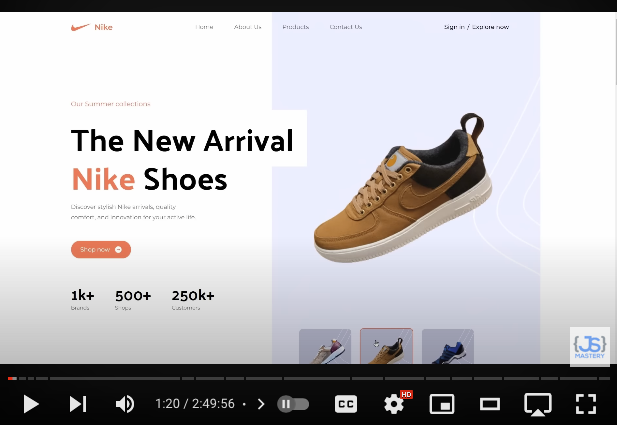
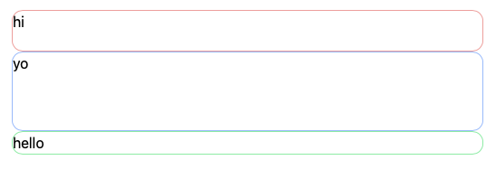
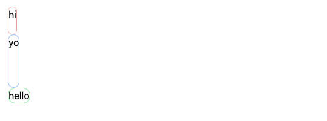
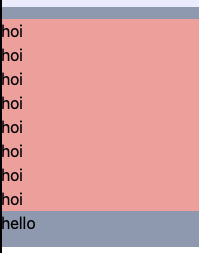
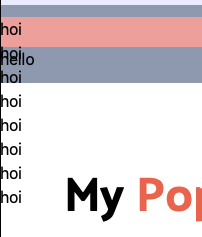
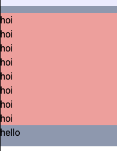
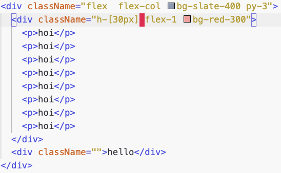

# 포트폴리오 README

<!--  -->

(클립으로 시청하기 ⬆️)

유투브에 있는 나이키 랜딩 페이지를 개편해 [나만의 포트폴리오 사이트](TODO:)로 만들었다.

이 프로젝트의 목표는 크게 두 가지이다. 첫째, 포트폴리오 사이트를 만드는 것. 둘째, tailwindcss 익히는 것이다.

## 바뀐 내용

- 불필요한 css 줄이기
- footer 정리
- 햄버거 메뉴 추가
- 스티키 헤더로 변경
- 프로젝트 보여주기용 모달 추가
- 서비스 섹션 오류 수정
- 고객 리뷰 -> 동료 리뷰
- 히어로 섹션의 신발 -> 나의 메타데이터
- quality 섹션 -> About me로 나의 코드 스탯

## Dev Log

 1~3 일차 

나이키 랜딩 페이지 유투브를 5번 정도 봤다. 어떤 사고의 흐름으로 페이지를 구성하는지, 어떤 점을 기준으로 컴포넌트로 빼는지, 반응형 웹사이트를 어떻게 단계별로 개발하는지를 중점으로 유투브를 시청했다.

유투브 시청만으로 개발자의 의도를 따라가기 벅찼기에 깃허브 레포지토리에서 코드를 읽었다. 그러나 처음 접한 tailwindcss가 발목을 잡았다. Bootstrap처럼 빠르게 스타일링을 도와주는 툴인 tailwindcss는 러닝커브가 높았지만 이 또한 극복해야할 산이라 여기고 공식 문서를 읽으며 기술을 익혔다.

css에 대한 기본 지식을 갖춘 상태라 낯설지 않았다. 다만 경험이 부족했기에 틈틈히 문서를 참조해 낯선 부분은 보강하였다.

4~5 일차

기존 코드를 그대로 따라치며 익히는 연습을 했다. 무작정 따라치다보니 지치기도 했지만 선배 개발자가 코드를 구성하는 순서를 익히려 노력했다. 그러다 불필요한 css 코드를 발견했고 불필요한 코드를 줄여 내가 이해하기 쉽도록 정리하는 게 도움이 될 것 같아 정리하는 중이다.

- `<header>` 태그를 따로 빼는 게 좋을까 아니면 `Header` 컴포넌트를 따로 만드는 게 좋을까?
- `
` 에 Background image 는 의미 그대로 백그라운드를 채울 이미지이다. 반면에 `` 태그는 콘텐츠로서 유의미한 이미지이다. 이미지의 의미는 alt로 정의한다.
- `` 태그를 어떻게 하면 쉽게 조작할까? `

`로 `flex`를 사용해 이미지를 다루면 가로 세로 비율에 따라 이미지가 늘어나기도 한다. 비율에 맞는 이미지를 여러장 준비해 `srcset`으로 관리하자.
- Wrapper 용 태그는 내부에 사용될 block element 의 배치만을 고려하자. (e.g. display, position)
- Tailwindcss 의 `container`는 오직 w-full -> 640px -> 768px -> 1024px -> 1280px -> 1536px 만을 고려하면 되므로 반응형을 쉽게 개발하게 도와준다. 이를 적극 활용하자.

스타일링을 수정할때 역시 추가하는 것보다 버리는 것이 정말 힘들었다. 그러나 불필요한 css를 정리했을때 다음 스타일링이 정말 편해짐을 느꼈다. 불필요한 스타일링을 버릴때 주의사항은 수정하는 아이템 뿐만 아니라 연관된 아이템까지 모두 전반적으로 어떻게 영향을 끼치는지 반드시 알고 있어야 한다.

6 일차

포트폴리오 소개용 웹사이트로 구상해보자

- 로고는 `BiPaperPlane` 로 종이 비행기 또는 `bi/BiCheckDouble`로 Wonnie의 W를 본따 더블체크 모양으로 할까
- Hero 섹션
  - 내 깃허브 링크 바로가기 버튼
  - 내 소개
  - 내가 한 포트폴리오 웹사이트 한장씩
- Product 섹션
  - 상세한 포트폴리오 소개
  - 아이템을 클릭하면 모달로 간편히 보여주기
- Quality 섹션
  - 나의 장점
  - 나의 협업 스킬
  - 내 기술 스킬
- About me 섹션
  - 내 기술 레벨을 알려주자
- Review 섹션
  - 동료들의 리뷰를 넣는다
  - 깃허브 프로필 사진을 넣는 게 좋을 듯

7~8 일차

[7 Practical Tips for Cheating at Design](https://medium.com/refactoring-ui/7-practical-tips-for-cheating-at-design-40c736799886)를 참고해 생생한 느낌을 줘보자.

- color와 font-weight으로 중요도 분별
- border 대신 그림자 효과로 아이템의 윤곽 살리기
- 아이템에 간격을 줘서 별개의 단락으로 구분하기
- 악센트 컬러를 적절히 사용해 특징을 구분하기

css를 수정하는 과정에서 tailwindcss에 대해 새로 배운 내용이 있다.

- tailwindcss 는 css cascades 룰에 따라 자동으로 정렬하여 스타일링을 매긴다. 예를들어 
의 경우 왼쪽에서 오른쪽 순서가 아니라 자동으로 구체적으로 선언한 것을 우선으로 하여 정렬한다. 따라서, y축은 3\*0.25rem, x축은 2\*0.25rem 만큼 패딩이 먹는다. (개발자 입장에서 혼돈을 줄 수 있으므로 [tailwindcss-prettier](https://www.npmjs.com/package/prettier-plugin-tailwindcss)를 사용하자. 이는 스타일을 추가하면 자동으로 코드에 반영되어 정렬해준다.)
- 그러나 때로는 스타일을 덮어쓰고 싶을때가 있다. 이럴때 [tailwind-merge](https://www.npmjs.com/package/tailwind-merge)를 이용하자. 자동으로 정렬하는 게 아닌 말 그대로 순서를 부여해 덮어버린다. 위의 예를 들면, x, y축 모두 패딩 3으로 덮어버릴 수 있다. 이는 공용 컴포넌트를 나에게 맞게 커스텀할때 사용할 수 있다.

9일차

포트폴리오 사이트로 만들던 중 몇가지 부족한 점이 있어서 업데이트 해보자

- Sticky header 만들기
- ~~scroll snap 추가~~
- 프로젝트 소개용 모달 추가
- 서비스 섹션의 카드 아이템 3개에 대해 반응형 수정

`flex`에 대해서 다시 한번 배울 수 있었다. 1차원 배치에는 flex가 좋고, 2차원 배치는 grid가 편하다.

- `display:flex`를 쓰면서 하부 아이템을 full width로 맞출때, 굳이 `w-full`를 같이 쓸 필요 없다.
- 아이템을 담는 wrapper용 블록에 flex를 선언할때 `align-items`를 쓰면 width가 아이템에 맞게 설정된다. Full width를 원한다면 `align-items`를 선언하지 말고, 만약 각 아이템별 width를 설정해야 한다면 wrapper용 블록이 아닌 아이템에 flex-1과 같이 비율로서 선언하는 게 좋다.

`align-items` 없을때:

`align-items:start`:

`align-items:center`:

10일차

- Hero.jsx를 보면 `<section>` 태그를 두 개로 나눴다. 왜냐하면 데스크탑 화면일때 한 화면에 담긴 블록이 모바일 화면일때 두 개의 섹션으로 분류되기 때문이다.
- 햄버거 메뉴 수정: tailwindcss 웹사이트와 mdn 웹사이트 메뉴 둘 중 후자를 선택했다. 왜냐하면 네비게이션 항목이 간단한 뿐더러 `<nav>`코드를 재사용하기 수월하기 때문이다.
- Hero 섹션에 높이를 `dvh`로 맞추는 과정에서 `height`와 `flex-1`을 같이 쓸 수 없다는 것을 배웠다. 만약 같이 쓴다면 `height`는 무시된다.

`flex-1 height`함께 썼을때:

`height`만 썼을때:

`flex-1`만 썼을때:

html 예시 코드:

이제 github 페이지에 depoly해보자.

## 아쉬운 점

포트폴리오에 쓰이는 이미지들을 화면 크기에 맞춰 여러장 준비하지 못했다. 그로인해 이미지가 늘어난 듯한 느낌을 주어 아쉬웠다. 포트폴리오 특성상 참여한 프로젝트에 너무 많은 설명을 달지 않으려 노력했다. 그러나 보는 이에 따라 간략한 내용이 부족한 내용으로 느껴질 수 있을 것이다.
